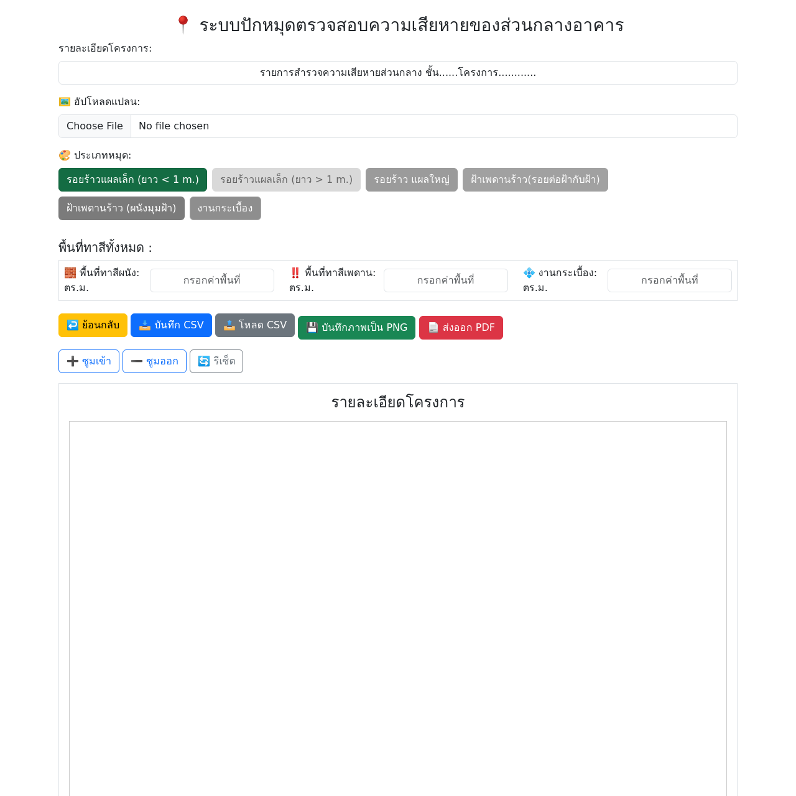

# 📍 ระบบปักหมุดตรวจสอบความเสียหายของส่วนกลางอาคาร

ระบบเว็บแอปพลิเคชันสำหรับบันทึกและตรวจสอบตำแหน่งความเสียหายของส่วนกลางอาคารบนแปลน พร้อมสรุปรายงานในรูปแบบ PNG, CSV และ PDF

## 🔗 ตัวอย่างหน้าจอ

---

## ✨ ฟีเจอร์หลัก

* อัปโหลดภาพแปลนอาคาร
* ปักหมุดระบุตำแหน่งความเสียหายตามประเภท
* นับจำนวนและสรุปความเสียหายแยกตามประเภท
* บันทึกข้อมูลลงไฟล์ **CSV** และโหลดกลับมาแก้ไขได้
* บันทึกภาพรวมเป็นไฟล์ **PNG**
* สร้างรายงานสรุปเป็นไฟล์ **PDF**
* ป้อนข้อมูลพื้นที่ผนัง เพดาน กระเบื้อง เพื่อคำนวณ
* รองรับ Undo / ซูมเข้า / ซูมออก / รีเซ็ตแผนที่

---

## 🚀 วิธีใช้งาน

1️⃣ เปิดไฟล์ `pin_system_full.html` ด้วยเว็บเบราว์เซอร์
2️⃣ กรอกรายละเอียดโครงการและพื้นที่ต่างๆ
3️⃣ อัปโหลดภาพแปลนอาคาร
4️⃣ เลือกประเภทความเสียหายและคลิกบนแผนที่เพื่อปักหมุด
5️⃣ ใช้ปุ่มด้านล่างเพื่อ:

* ↩️ **ย้อนกลับ (Undo)**
* 📥 **บันทึก CSV**
* 📤 **โหลด CSV**
* 💾 **บันทึก PNG**
* 📄 **ส่งออก PDF**

---

## 🛠️ โครงสร้างไฟล์

* `Index.html` — ไฟล์หลักของระบบ พร้อม CSS/JS ในตัว
* `screenshot.png` — ภาพตัวอย่างหน้าจอ

---

## 🧑‍💻 ผู้พัฒนา

> ระบบสำรวจความเสียหายส่วนกลางอาคาร V1.3
> © 2025 by **Adisorn**

---

## 📜 License

This project is licensed under the MIT License.

---
